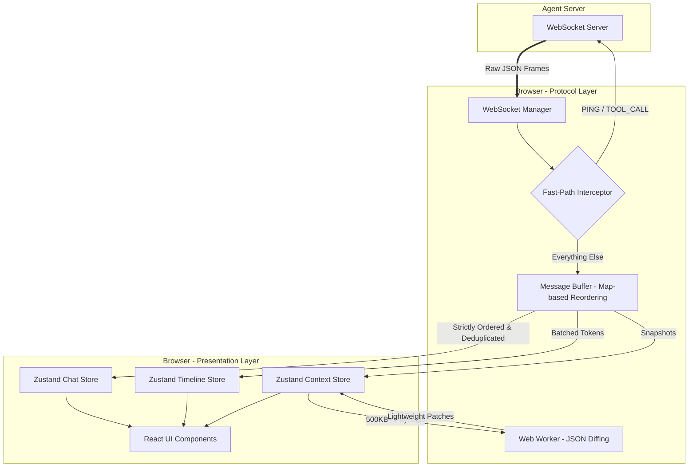

```mermaid
graph TD
    subgraph "Agent Server"
        WS["WebSocket Server"]
    end

    subgraph "Browser - Protocol Layer"
        WSM["WebSocket Manager"]
        FP{"Fast-Path Interceptor"}
        MB["Message Buffer - Map-based Reordering"]
        WW["Web Worker - JSON Diffing"]
    end

    subgraph "Browser - Presentation Layer"
        ZC["Zustand Chat Store"]
        ZT["Zustand Timeline Store"]
        ZX["Zustand Context Store"]
        UI["React UI Components"]
    end

    WS ==>|Raw JSON Frames| WSM
    WSM --> FP

    FP -->|PING / TOOL_CALL| WS
    FP -->|Everything Else| MB

    MB -->|Strictly Ordered & Deduplicated| ZC
    MB -->|Batched Tokens| ZT
    MB -->|Snapshots| ZX

    ZX -->|500KB+ Payloads| WW
    WW -->|Lightweight Patches| ZX

    ZC --> UI
    ZT --> UI
    ZX --> UI
```
