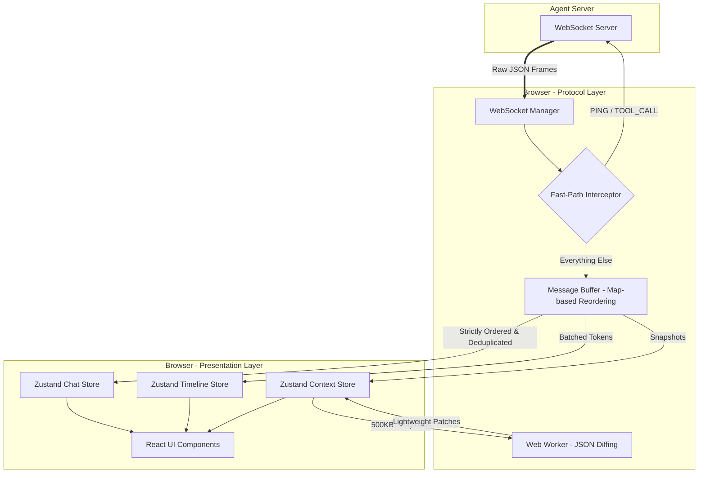

## Architecture

This application is built on a strict separation between a Protocol Layer (handling raw WebSocket frames, reordering, and synchronous heartbeats) and a Presentation Layer (Zustand stores and React components). The Protocol Layer utilizes a Map-based reordering buffer and a synchronous Fast-Path to guarantee sub-millisecond `PONG` and `TOOL_ACK` responses, completely decoupling network compliance from React's render cycle. This architecture ensures the UI remains responsive and state remains consistent even under the extreme main-thread blocking conditions introduced by the backend's Chaos Mode.
```cmd
cd agent-server
npm install
npm run build
node dist/index.js <params>
```
params : mode | port (eg node dist/index.js --mode chaos --port 8080)

```cmd
cd agent-client
npm install
npm run build
npm run dev
```

## WebSocket State Machine

The connection lifecycle is managed by a strict state machine to handle Chaos Mode drops and multi-turn conversations seamlessly.

---



## Screenshots 


## [Video for chaos mode](https://youtu.be/IsBKILBi9PM) 


PS: This is my alt account you can go to my main @yuvraajnarula => https://www.github.com/yuvraajnarula for my profile :)
